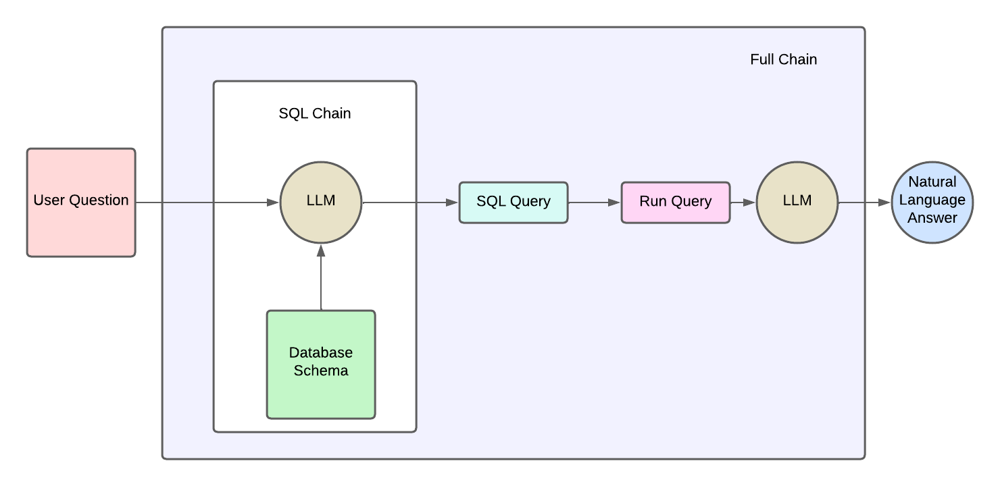

# Build a Natural Language SQL Chatbot with GPT-4 and Mistral AI
# MySQL Python Chatbot with GPT-4 and Mistral AI

In this project, I've developed a chatbot that interprets natural language queries, generates SQL queries, and fetches results from a SQL database, all within a user-friendly interface. The project leverages OpenAI's GPT-4 model and is integrated with a Streamlit GUI for enhanced interaction.

## Features
- **Natural Language Processing**: Utilizes GPT model to interpret and respond to user queries in natural language.
- **SQL Query Generation**: Automatically generates SQL queries based on the user's natural language input.
- **Database Interaction**: Connects to a SQL database to retrieve and display query results.
- **Streamlit GUI**: Provides an intuitive interface built with Streamlit, making it accessible for users of all skill levels.
- **Python-based**: Fully implemented in Python, demonstrating best practices in modern software development.

## Architecture of the Chatbot

The chatbot operates by transforming a user's natural language query into a SQL query via GPT model, executing it on a SQL database, and then returning the results in natural language. This workflow involves multiple steps of data processing and interaction with the OpenAI API and a SQL database, all smoothly integrated into a Streamlit application.

